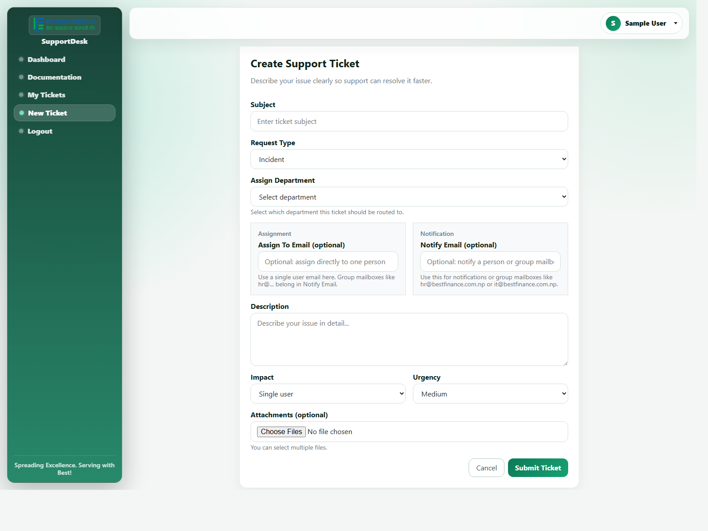
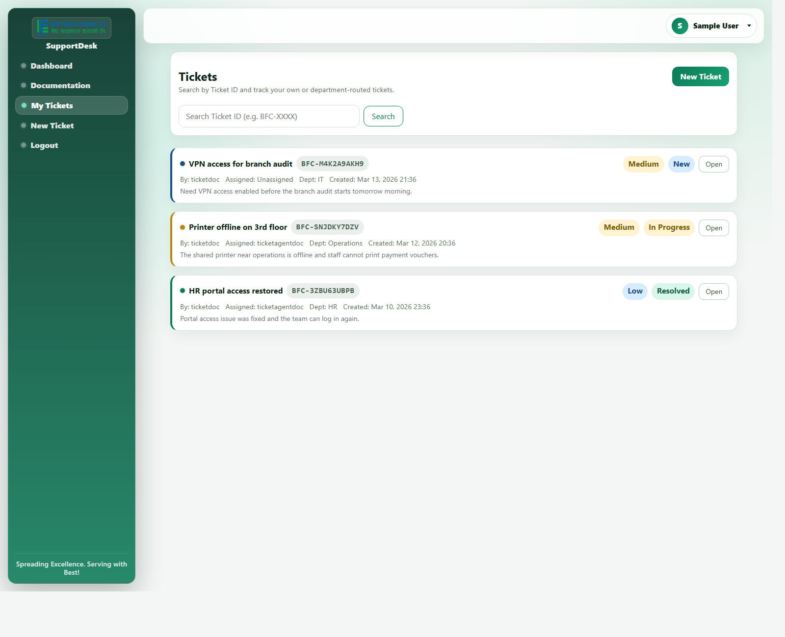

# How to Raise a Ticket in BESTSUPPORT

If you need help from IT, HR, or another support team, the best place to start is the `New Ticket` page. A clear ticket helps the right team see the issue quickly and respond without having to come back for basic details.

You can open the ticket form from:

- `Dashboard > Create Ticket`
- `Sidebar > New Ticket`

The page itself lives at `/tickets/new/`.

The screenshot above shows the page you will use to raise a new support ticket.

## Before you begin

Make sure you are signed in. Only logged-in users can create tickets.

It also helps to have these details ready before you start:

- A short title for the issue
- A clear explanation of what happened
- The right support team, if you already know it
- Any screenshots, files, or documents that would help someone understand the problem

## Step-by-step

### 1. Open the New Ticket page

After logging in, click `New Ticket` from the left sidebar or `Create Ticket` from the dashboard.

### 2. Add a subject

Write a short title that tells the support team what the issue is.

Good examples:

- `Unable to log in to core banking`
- `Need access to HR shared folder`
- `Printer on 3rd floor is offline`

Try to avoid subjects that are too vague, such as:

- `Help`
- `Issue`
- `System not working`

### 3. Choose the request type

Pick the option that best matches what you need:

- `Incident`: Something is broken or not working as expected.
- `Service Request`: You need help with a normal service or task.
- `Access Request`: You need access to a system, file, or resource.
- `Change`: You are requesting a planned change.

If you are not completely sure, choose the closest match and explain the rest in the description.

### 4. Select a department if needed

Use `Assign Department` when you already know which team should see the ticket first, such as `IT`, `HR`, or another department configured in the system.

If the ticket is routed to a department and no one is directly assigned yet, users from that department can see it in their queue and take ownership.

### 5. Decide whether the ticket should be assigned or just notified

This page has two different email fields, and they do different jobs.

#### Assign To Email

Use this when you want the ticket to go straight to one specific person.

Important rules:

- It must be the email address of one real user in the system.
- It cannot be your own email address.
- It must not be a group mailbox.

This field is for direct ownership.

#### Notify Email

Use this when you want a person or a shared mailbox to receive the new-ticket email.

This field is good for:

- A department mailbox such as `hr@bestfinance.com.np`
- A team mailbox such as `it@bestfinance.com.np`
- An individual email address when someone simply needs to be informed

This field is for notification, not ownership.

That means:

- `Notify Email` sends the ticket email.
- `Notify Email` alone does not assign the ticket to a user.

If you leave `Notify Email` blank, the system sends the notification to the default support mailbox.

### 6. Describe the issue properly

The `Description` box is the most important part of the ticket. This is where you help the support team understand what happened.

A useful description usually answers these questions:

- What were you trying to do?
- What happened instead?
- When did it start?
- Who is affected?
- Have you already tried anything?

Example:

`I was able to log in yesterday, but today the HR portal says access denied. This started on Friday morning. I am the only one affected in my team as far as I know. I tried logging out and back in, but the same message appears.`

### 7. Choose impact and urgency carefully

These two fields are used by the system to calculate priority automatically.

#### Impact

- `Single user`: One person is affected
- `Department`: A team or department is affected
- `Entire org`: The issue affects the wider organization

#### Urgency

- `Low`: Can wait
- `Medium`: Should be handled soon
- `High`: Work is seriously affected
- `Critical`: Immediate attention is needed

You do not set the final priority yourself. The system calculates it from the values you choose here.

### 8. Add attachments if they help

You can upload more than one file in the `Attachments` field.

Attachments are useful for:

- Error screenshots
- Supporting documents
- Logs or exported files

By default, the system allows files up to `20 MB` each unless the server has been configured differently.

### 9. Submit the ticket

Click `Submit Ticket` when everything looks right.

If the form is valid, the system will create the ticket and return you to `My Tickets`.

## What happens after you submit

Once the ticket is created:

- The ticket starts in `New` status.
- A ticket code is generated automatically in the format `BFC-XXXXXXXXXX`.
- The system calculates the priority from `Impact` and `Urgency`.
- You become the requester.
- If you used `Assign To Email`, the selected user becomes the assignee.
- The system sends a notification email to `Notify Email`.
- If `Notify Email` is empty, the system sends the ticket email to the default support mailbox.
- If the ticket was assigned to another user, that person also receives an assignment email.

After that, you can open `My Tickets` to follow the progress, search by ticket ID, and open the ticket details page.

This is the page where users can look up the ticket again, check status and priority, and open the full ticket details.

## How to take ownership of a department ticket

Sometimes people say a ticket is "assigned to GSD" or "assigned to CAD." In this app, that usually means the ticket has been routed to that department queue, but it may still be unassigned to any one person.

For example:

- If the ticket department is `GSD`, users whose profile department is `GSD` can see that ticket in their queue.
- If the ticket department is `CAD`, users whose profile department is `CAD` can see that ticket in their queue.

If the ticket is still unassigned, an eligible department user will see a `Take Ownership` button in `My Tickets`.

To take ownership:

1. Open `My Tickets`.
2. Find the ticket that belongs to your department.
3. Look for the `Department Queue` label and the `Take Ownership` button.
4. Click `Take Ownership`.
5. The system will assign the ticket to you and open the ticket update page.

Important rules:

- You can take ownership only if your profile department matches the ticket department.
- You can take ownership only if the ticket is not already assigned to another person.
- You cannot take ownership of a ticket you created yourself.
- If the ticket belongs to another department, you will not be able to claim it.

If the ticket is already assigned to someone else, you cannot take it over directly with the `Take Ownership` button. In that situation, ask the current owner or the support/admin team to review the assignment.

## Using the ticket chat

Once a ticket has been created, the detail page includes a `Ticket Chat` section. This is the conversation area for the requester and the support side to talk inside the ticket instead of relying only on email.

What you can do in the chat section:

- Read the full message history for that ticket
- Send a new text message
- Upload a file into the chat
- Download files that were already shared in the conversation

If an uploaded file is an image, the ticket page shows a preview. Other file types appear as a download link.

This is useful when you need to share:

- screenshots
- documents
- exported files
- logs or notes related to the ticket

Important points:

- The chat is available from the ticket detail page, not from the create form itself.
- The requester, the assigned owner, and support/admin users are the main users of the live chat flow.
- If a ticket is only sitting in a department queue, a department user may need to take ownership first before working on it fully.
- When the ticket is closed, chat becomes read-only and no new messages or chat attachments can be added.

## Using the audio call feature

The same ticket detail page also includes an audio call feature at the top of the `Ticket Chat` section.

You will see:

- `Start Audio Call`
- `Hang Up`
- a small call status indicator such as `idle`, `waiting for peer`, or `connected`

How it works:

1. Open the ticket detail page.
2. Go to the `Ticket Chat` section.
3. Click `Start Audio Call`.
4. Allow microphone access in the browser if prompted.
5. The other participant receives an incoming call notification for that ticket.
6. Use `Hang Up` to end the call.

Important points:

- This is an audio-only feature. It does not start a video call.
- The browser must allow microphone access.
- The microphone feature requires HTTPS or localhost in the browser.
- The call feature is tied to the ticket, so users can talk while looking at the same ticket information and chat history.
- Closed tickets cannot start or receive calls from this screen.

## Simple guidance for choosing the right fields

Use this quick rule of thumb:

- If one person should own the ticket, use `Assign To Email`.
- If a team mailbox should be informed, use `Notify Email`.
- If a department should see it in their queue, use `Assign Department`.

Common example:

- `Assign Department`: `HR`
- `Assign To Email`: leave blank
- `Notify Email`: `hr@bestfinance.com.np`

This routes the ticket to HR and sends the email to the HR mailbox, without forcing it onto one specific person.

## Common mistakes

### Using a group mailbox in Assign To Email

Do not enter addresses such as `hr@bestfinance.com.np` or `it@bestfinance.com.np` in `Assign To Email`.

The system will reject that and ask you to use `Notify Email` instead.

### Assigning the ticket to yourself

The system does not allow you to assign a new ticket to your own account from the create form.

### Using Notify Email when you meant assignment

This is a common misunderstanding. `Notify Email` sends the email, but it does not make that user the owner of the ticket.

If you want a specific person to own the ticket, use `Assign To Email`.

### Uploading files that are too large

If a file is larger than the allowed limit, the form will reject it.

## A few practical tips

- Keep the subject short, but specific.
- Put the full story in the description.
- Use attachments when they save time for the support team.
- If the issue affects many people, reflect that in `Impact`.
- If work is blocked right now, reflect that in `Urgency`.

## Related page

After submitting, you can track the ticket from `My Tickets`, where you can search by ticket ID, open the detail page, and continue the conversation on the ticket.
